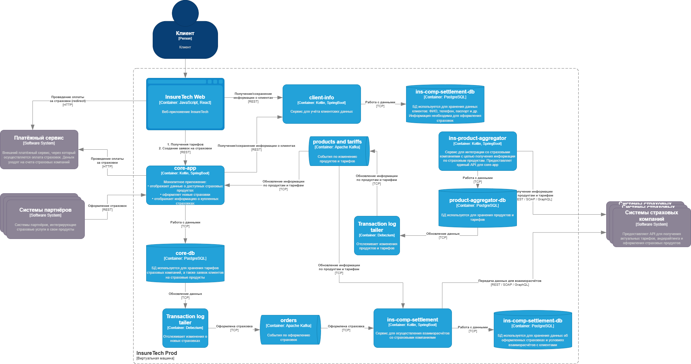
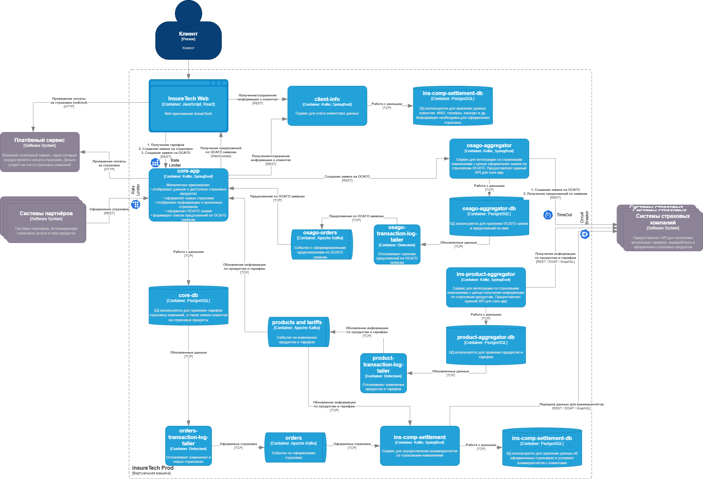

# architecture-insuretech

## Task1
Ссылка на схему: [схема](https://raw.githubusercontent.com/kihana/architecture-insuretech/refs/heads/sprint6/Task1/InureTech_%D1%82%D0%B5%D1%85%D0%BD%D0%BE%D0%BB%D0%BE%D0%B3%D0%B8%D1%87%D0%B5%D1%81%D0%BA%D0%B0%D1%8F%20%D0%B0%D1%80%D1%85%D0%B8%D1%82%D0%B5%D0%BA%D1%82%D1%83%D1%80%D0%B0_to-be.xml)


## Task2
Лог изменения нагрузки:


Дашборд изменения нагрузки:


Количество подов всего:


История изменения количества подов:


## Task3

Проблемы:

- Из-за синхронного взаимодействия при увеличении нагрузки придется масштабировать все сервисы связанные с ins-product-aggregator.

- Сервис ins-comp-settlement забирает данные из ins-product-aggregator и core-app раз в сутки. Соответственно за сутки может накопиться много данных. Потенциально могут возникнуть следующие проблемы: долгая обработка данных, что может заблокировать сервис на долгое время, или сервис впринципе не справится с поступившим объемом данных.

- Думаю минорная проблема для данного домена, но всеже: данные обновляются по таймеру, т.е. пользователи могут работать с неактуальными данными.

- Добавление новых страховых компаний лишь усугубит все перечисленные проблемы.

Диаграмма контейнеров:


## Task 4

Диаграмма контейнеров:


## Task 5

Схема GraphQL: 
[Схема GraphQL](Task5/client-info.gql)

```
type Client {
    id: ID!
    name: String!
    age: Int!
    documents: [Document!]
    relatives: [Relative!]
}

type Document {
    id: ID!
    type: String!
    number: String!
    issueDate: String!
    expiryDate: String!
}
     
type Relative {
    id: ID!
    relationType: String!
    name: String!
    age: Int!
}


type Query {
  getClient(id: ID!): Client
  getClientDocuments(id: ID!): [Document]
  getClientRelatives(id: ID!): [Relative]
}
```

## Task 6

Конфиг nginx: 
[Конфиг nginx](Task6/nginx.conf)

```
http {
   # Настройка upstream для балансировки нагрузки
   upstream backend_servers {
       server backend1.example.com;
       server backend2.example.com;
       server backend3.example.com;
   }

   limit_req_zone $binary_remote_addr zone=mylimit:10m rate=10r/m;

   server {
       listen 80;

       location / {
           limit_req zone=mylimit;
           limit_req_status 429;

           proxy_pass http://backend_servers;
       }

   }
}
```