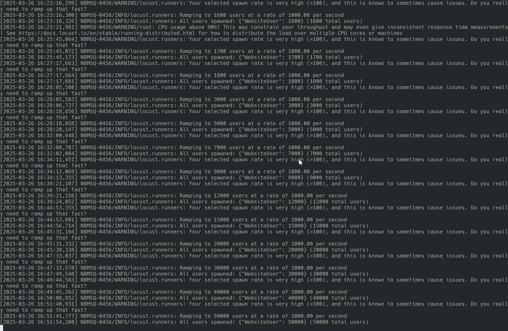
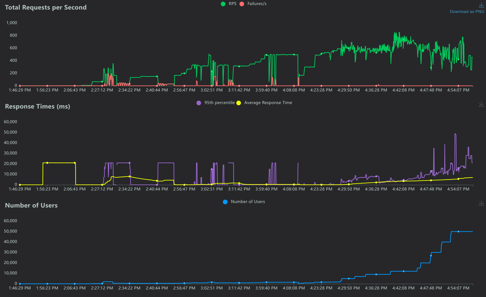
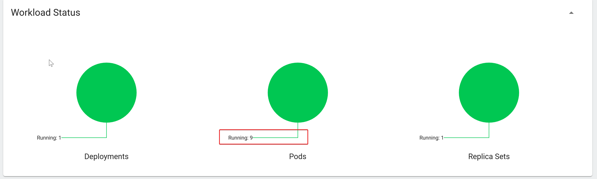
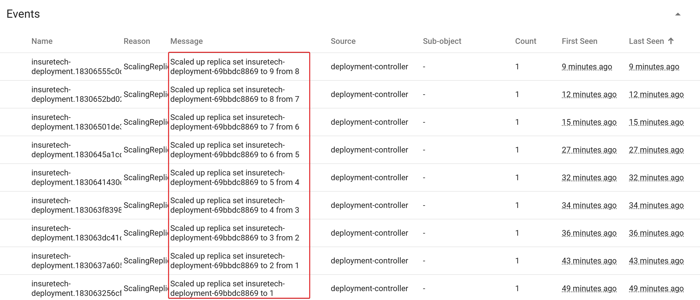

# architecture-insuretech

## Task1
Ссылка на схему: [схема](https://raw.githubusercontent.com/kihana/architecture-insuretech/refs/heads/sprint6/Task1/InureTech_%D1%82%D0%B5%D1%85%D0%BD%D0%BE%D0%BB%D0%BE%D0%B3%D0%B8%D1%87%D0%B5%D1%81%D0%BA%D0%B0%D1%8F%20%D0%B0%D1%80%D1%85%D0%B8%D1%82%D0%B5%D0%BA%D1%82%D1%83%D1%80%D0%B0_to-be.xml)

## Task2
Лог изменения нагрузки:

Дашборд изменения нагрузки:

Дашборд изменения нагрузки:

Количество подов всего:

История изменения количества подов:
